# Rebisyon
Uma aplicação desktop para revisão ativa e espaçada de flashcards.
# Funcionalidades
- [x] Visualizar baralhos cadastrados.
- [x] Visualizar quantidade de cartões a serem aprendidos, re-estudados e revisados de cada baralho.
- [x] Adicionar baralhos no banco de dados.
- [x] Remover baralhos do banco de dados (e os cartões que estão dentro deles).
- [x] Adicionar cartões em um baralho específico no banco de dados.
- [x] Em cada cartão, pode ser adicionada uma pergunta, uma resposta e tags.
- [x] Nos campos de pergunta e resposta, podem ser adicionados textos com as seguintes formatações:
  - [x]  Negrito (com atalho).
  - [x]  Itálico (com atalho).
  - [x]  Sublinhado (com atalho).
  - [x]  Riscado/strike.
  - [x]  Sobrescrito.
  - [x]  Subescrito.
  - [x]  Lista não ordenada.
  - [x]  Lista ordenada.
  - [x]  Cor do texto.
  - [x]  Cor de fundo.
  - [x]  Alinhamento à esquerda.
  - [x]  Alinhamento ao centro.
  - [x]  Alinhamento à direita.
  - [x]  Alinhamento justificado.
  - [x]  Adição de recuo/indentação.
  - [x]  Remoção de recuo/indentação.
  - [x]  Adição de link.
  - [x]  Alteração do tamanho do texto (7 tamanhos diferentes).
  - [x]  Adição de uma linha horizontal divisória.
  - [x]  Alteração da família da fonte (7 estilos diferentes).
  - [x]  Adição de cabeçalhos/títulos (6 títulos diferentes).
  - [x]  Adição de checkboxes/caixas de seleção.
  - [x]  Adição de emojis.
  - [x]  Adição de citação (1 estilo disponível).
  - [x]  Remoção das formatações (remove a maior parte da formatações).
- [x] Nos campos de pergunta e resposta, podem ser adicionadas imagens e GIFs redimensionáveis.
# Screenshots (desatualizada)
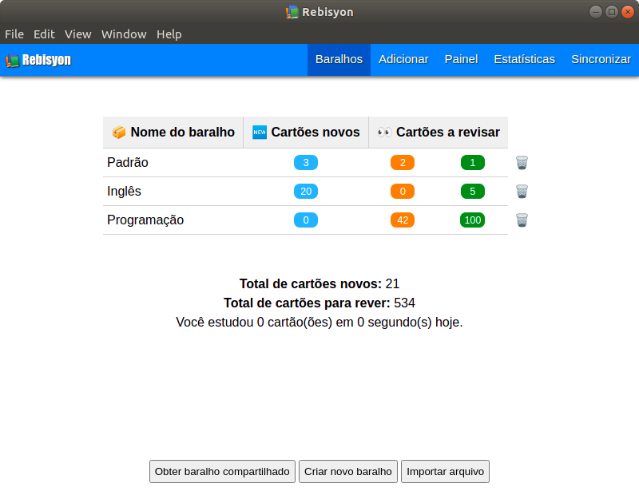

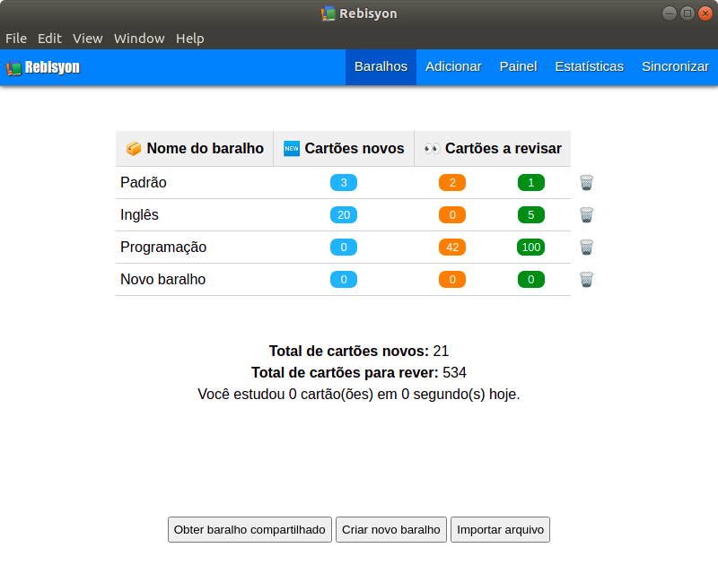
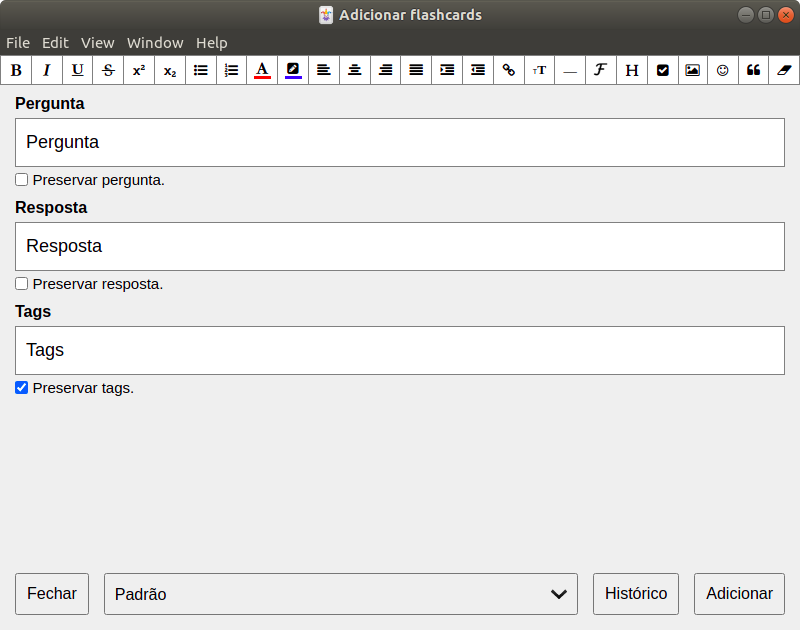

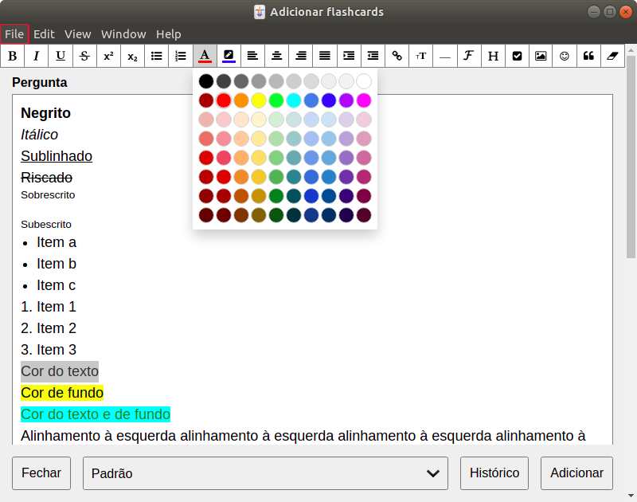
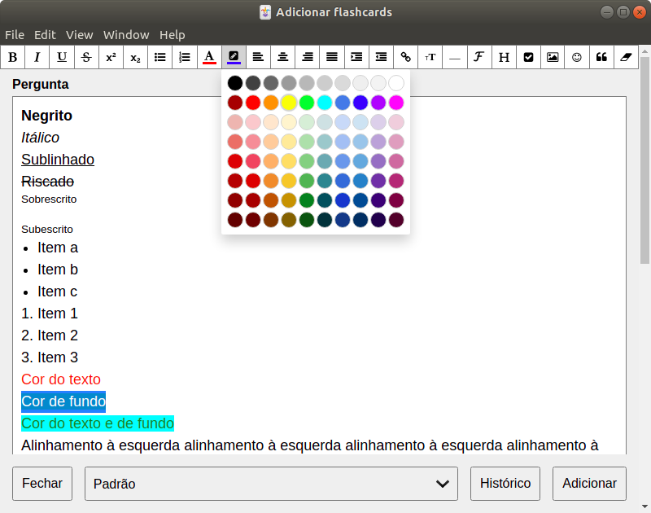
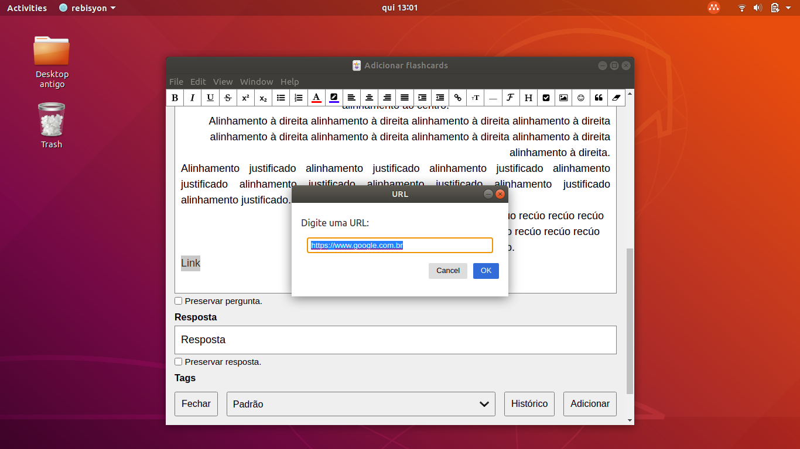
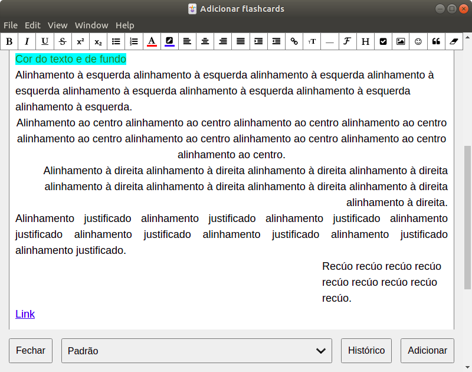

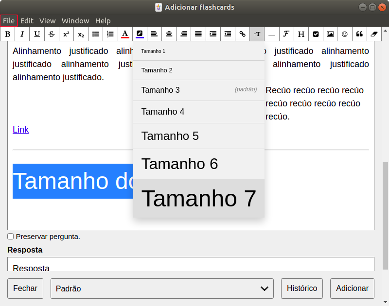

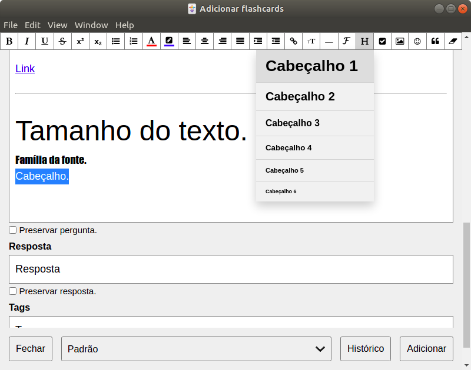

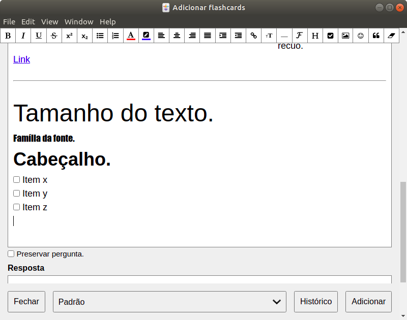

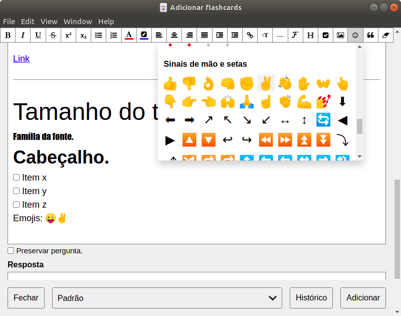

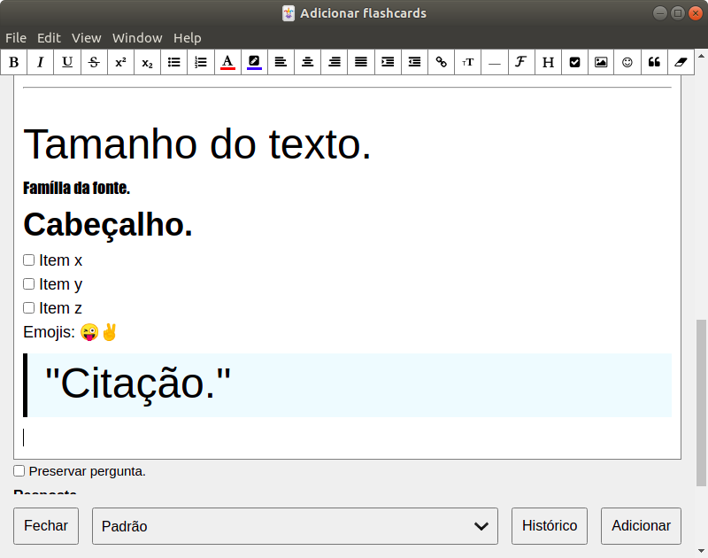v

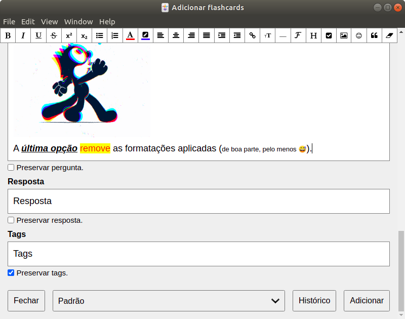
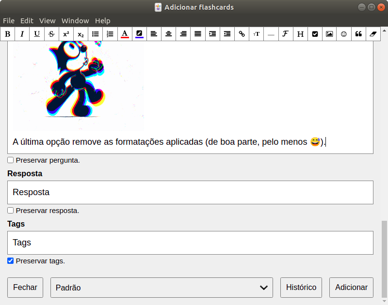

